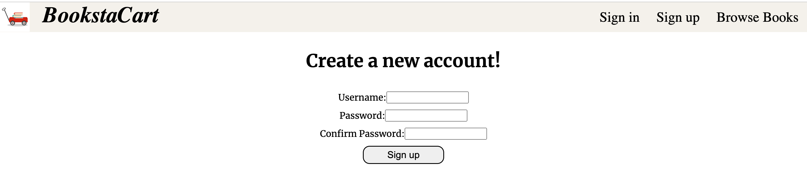
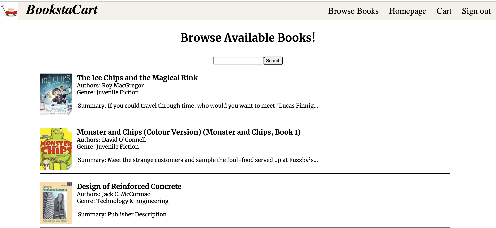
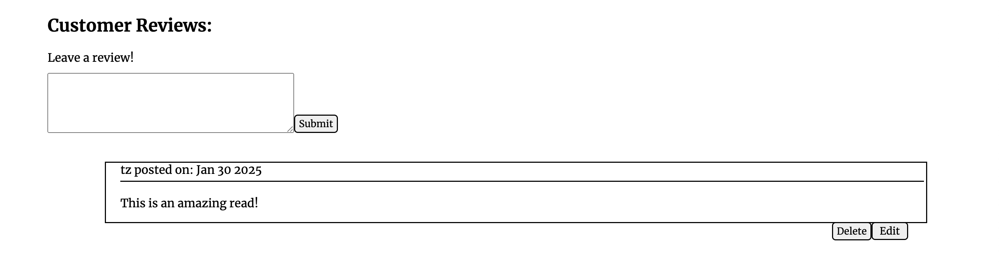

# Bookstacart

#### Tehilah Zamanzadeh

## Decription

Bookstacart that hosts a selection of books Users can browse a selection of books, review on books, and add books to their cart to purchase. Bookstacart is connected to database of books, and users can search for books and add the mto Bookstacart's selection. Welcome to Bookstacart, where there are endless books to explore!

## Screenshots

|    Description     | Screenshot                                                                               |
| :----------------: | ---------------------------------------------------------------------------------------- |
| **Sign up/Login ** |      |
|    **Homepage**    |                                              |
|  **Browse Books**  |                                                |
| **Searched Books** |                                        |
| **Specific Book**  |                                             |
| **Review a Book**  |   |
| **Edit a review**  |                                                  |
|      **Cart**      |                                                  |

## Technologies Used

## Using BookstaCart

  

  
 How to Add and Search For Books 

    On the Homepage and the Browse For Books page, there are search bars. The Homepage search allows you to add books from Google API into Bookstacart. The search on the Browse page allows yo uto search for specific books within Bookstacart. SImply enter a search term and submit! 

  
 How to Purchase a Book

  On the Browse page you can slect any of the books available to you. You will be directed to a page with more information about the book. If you wish to purchase the book, click the add to cart button, and the book will authomatically be added to your cart. From ther you can add more, delete one or all, and purchase your books. 

  
 Leave a comment 

  Select the book you wish to review, scroll down to the comment section and enter your review into the open text area. You can submit your review, edit it later, or delete it.  

  
 Trello Board 

  <a href="https://trello.com/b/c1Wt355y/bookstacart"
    > https://trello.com/b/c1Wt355y/bookstacart</a
  >

  
 Deployed Link 

  <a href="--- "
    > -- </a
  >

  
 Challenges and Key Take Aways 

  I found adding the search features for users to be the most exciting part of the project. It was something new and I enjoyed the challenge of figuring out how to implement exactly what I wanted. 
  Consuming the Google API and learning how to implrement referencing data were my biggest challenges during this project. I learned a lot pushing myself to do new things and take on the harder tasks, and I enjoyed building Bookstacart.  

## Upcoming Features HERE

- [X] Users can edit/delete only their own reviews

- [ ] Ability to enter user information

- [ ] Purchase feature

- [ ] Pop ups when books are added to cart

- [ ] Notification when browse section or cart is empty
